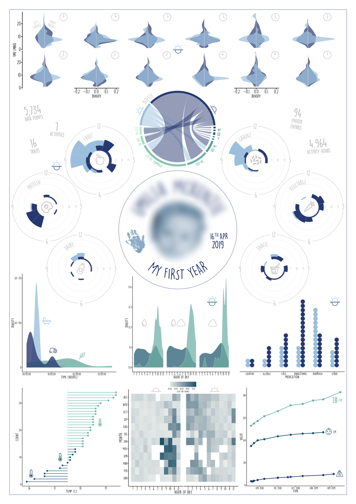

# Infographics

### Matt Malishev  
### @darwinanddavis  

******      

## My First Year    

Daily life for the first year of a 1-year-old using client data from the [Babytracker](https://play.google.com/store/apps/details?id=com.amila.parenting&hl=en_AU&gl=US) app.        

<h3><a style="color:#939DB9;" href="myfirstyear/img/myfirstyear.pdf">Click for full infographic</a></h3>  

  
    

  
    
    
    

******      

  <h2 style="color:#939DB9;">Digital footprint</h2>
  

    <!--   -->
     
     
  

